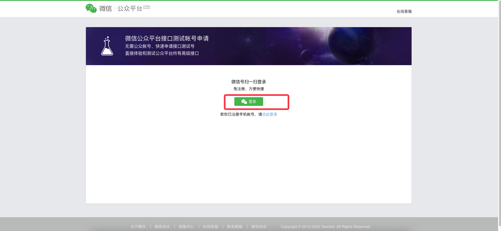
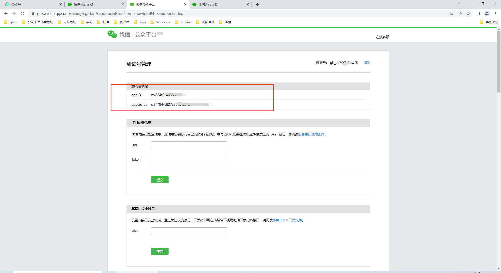
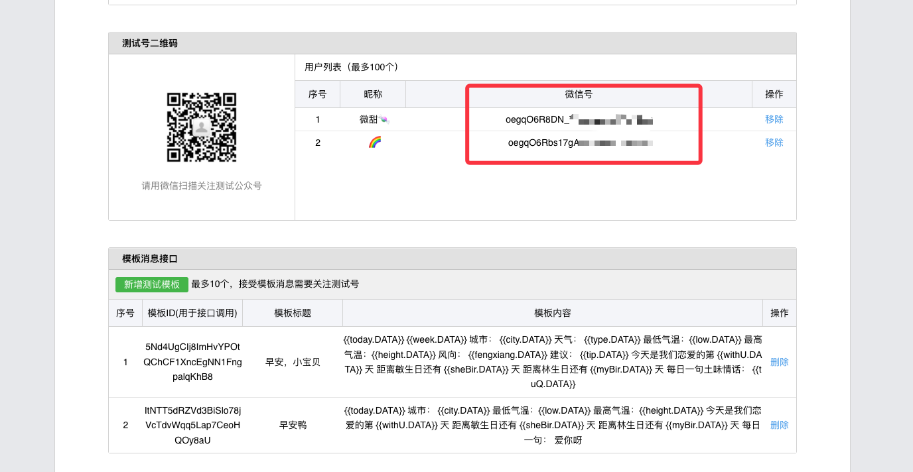
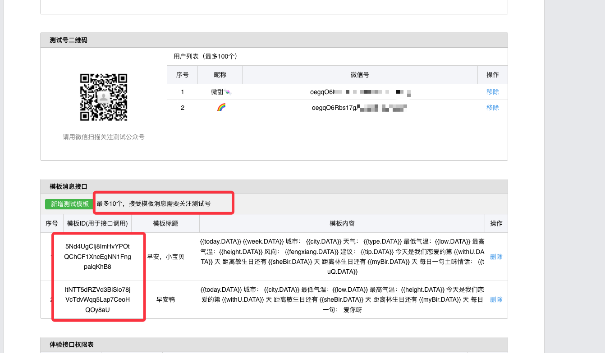
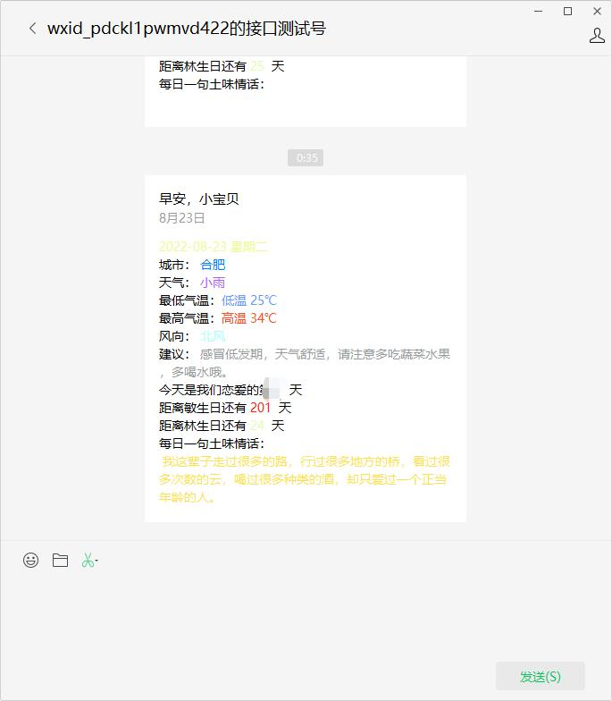
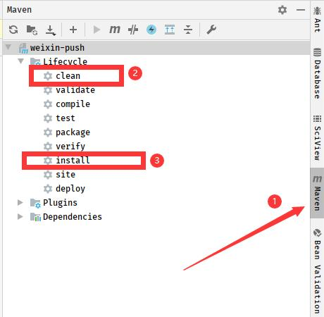
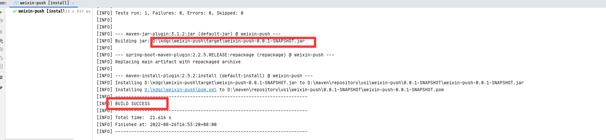
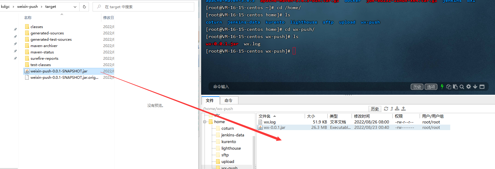

# 微信模板推送

## 如何获取ACCESS_TOKEN？

访问如下网址，有相关获取token方式
https://developers.weixin.qq.com/doc/offiaccount/Basic_Information/Get_access_token.html

- 请求地址

```text
 https://api.weixin.qq.com/cgi-bin/token?grant_type=client_credential&appid=APPID&secret=APPSECRET
```

- 请求方式 GET 
 
- 请求参数说明 
 
|  参数   |  说明  |
|  ----  | ----  |
| grant_type |获取access_token填写client_credential |
| appid  |第三方用户唯一凭证 |
| secret   |第三方用户唯一凭证密钥，即appsecret |

- 返回结果说明

正常情况下，微信会返回下述 JSON 数据包给公众号；

```json
{"access_token":"ACCESS_TOKEN","expires_in":7200}
```

- 返回结果说明

|  参数   |  说明  |
|  ----  | ----  |
| access_token |获取到的凭证 |
| expires_in  |凭证有效时间，单位：秒 |

** 错误时微信会返回错误码等信息，JSON数据包示例如下（该示例为 AppID 无效错误） **

```json
{"errcode":40013,"errmsg":"invalid appid"}
```

- 返回码说明

|  参数   |  说明  |
|  ----  | ----  |
| -1 |系统繁忙，此时请开发者稍候再试 |
| 0  |请求成功 |
| 40001 |AppSecret错误或者 AppSecret 不属于这个公众号，请开发者确认 AppSecret 的正确性 |
| 40002  |请确保grant_type字段值为client_credential |
| 40164 |调用接口的 IP 地址不在白名单中，请在接口 IP 白名单中进行设置。 |
| 89503  |此 IP 调用需要管理员确认,请联系管理员 |
| 89501 |此 IP 正在等待管理员确认,请联系管理员 |
| 89506  |24小时内该 IP 被管理员拒绝调用两次，24小时内不可再使用该 IP 调用|
| 89507 |1小时内该 IP 被管理员拒绝调用一次，1小时内不可再使用该 IP 调用 |


## 微信模板操作API

### 获取模板列表

- 请求地址
```text
https://api.weixin.qq.com/cgi-bin/template/get_all_private_template?access_token=ACCESS_TOKEN
```
- 请求方式
 
http请求方式：GET

- 请求参数

ACCESS_TOKEN 接口调用凭证

- 返回结果

```json
{	
     "template_list": [{
      "template_id": "iPk5sOIt5X_flOVKn5GrTFpncEYTojx6ddbt8WYoV5s",
      "title": "领取奖金提醒",
      "primary_industry": "IT科技",
      "deputy_industry": "互联网|电子商务",
      "content": "{ {result.DATA} }\n\n领奖金额:{ {withdrawMoney.DATA} }\n领奖  时间:    { {withdrawTime.DATA} }\n银行信息:{ {cardInfo.DATA} }\n到账时间:  { {arrivedTime.DATA} }\n{ {remark.DATA} }",
      "example": "您已提交领奖申请\n\n领奖金额：xxxx元\n领奖时间：2013-10-10 12:22:22\n银行信息：xx银行(尾号xxxx)\n到账时间：预计xxxxxxx\n\n预计将于 xxxx 到达您的银行卡"
   }]
}
```


- 返回结果字段说明

|  参数   |  说明  |
|  ----  | ----  |
| access_token |接口调用凭证 |
| template_id  |模板ID |
| title   |模板标题 |
| primary_industry  |模板所属行业的一级行业 |
| deputy_industry  |模板所属行业的二级行业 |
| content   |模板内容 |
| example |模板示例 |


### 删除模板

- 说明

删除模板可在微信公众平台后台完成，为方便第三方开发者，提供通过接口调用的方式来删除某帐号下的模板

- 请求地址
```text
https://api.weixin.qq.com/cgi-bin/template/del_private_template?access_token=ACCESS_TOKEN
```
- 请求方式
 
http请求方式：POST

- 请求参数

```json
 {  
     "template_id" : "Dyvp3-Ff0cnail_CDSzk1fIc6-9lOkxsQE7exTJbwUE"
 }
```
参数说明

|  参数   |  说明  |
|  ----  | ----  |
| access_token |接口调用凭证 |
| template_id  |模板ID |


- 返回结果

```json
{
   "errcode" : 0,
   "errmsg" : "ok"
}
```


### 发送模板消息 

- 请求地址
```text
 https://api.weixin.qq.com/cgi-bin/message/template/send?access_token=ACCESS_TOKEN
```
- 请求方式
 
http请求方式：POST

- 请求参数

```json
{
           "touser":"oegqO6Rbs17gABy5trtotbJK82Q0",
           "template_id":"OlLU_XCVx1UdyEN_WH1gggT9TLPuP9CpywvNH5q_y60",
           "miniprogram":{
             "appid":"xiaochengxuappid12345",
             "pagepath":"index?foo=bar"
           },
           "client_msg_id":"MSG_000001",
           "data":{
                   "first": {
                       "value":"恭喜你购买成功！",
                       "color":"#173177"
                   },
                   "keyword1":{
                       "value":"巧克力",
                       "color":"#173177"
                   },
                   "keyword2": {
                       "value":"39.8元",
                       "color":"#173177"
                   },
                   "keyword3": {
                       "value":"2014年9月22日",
                       "color":"#173177"
                   },
                   "remark":{
                       "value":"欢迎再次购买！",
                       "color":"#173177"
                   }
           }
       }
```

**请求参数说明**

|  参数   | 是否必填 | 说明  |
|  ----  | ----  | ----  |
| touser | 是 |接收者openid |
| template_id | 是 |模板ID |
| url  | 否 |模板跳转链接（海外帐号没有跳转能力） |
| miniprogram | 否 |跳小程序所需数据，不需跳小程序可不用传该数据 |
| appid | 是 |所需跳转到的小程序appid（该小程序 appid 必须与发模板消息的公众号是绑定关联关系，暂不支持小游戏） |
| pagepath | 否 |所需跳转到小程序的具体页面路径，支持带参数,（示例index?foo=bar），要求该小程序已发布，暂不支持小游戏 |
| data | 是 |模板数据 |
| color | 否 |模板内容字体颜色，不填默认为黑色 |
| client_msg_id | 否 |防重入id。对于同一个openid + client_msg_id, 只发送一条消息,10分钟有效,超过10分钟不保证效果。若无防重入需求，可不填 |

注：url和 miniprogram 都是非必填字段，若都不传则模板无跳转；若都传，会优先跳转至小程序。开发者可根据实际需要选择其中一种跳转方式即可。当用户的微信客户端版本不支持跳小程序时，将会跳转至url。

- 返回结果
在调用模板消息接口后，会返回 JSON 数据包。正常时的返回 JSON 数据包示例
```json
 {
    "errcode":0,
     "errmsg":"ok",
     "msgid":200228332
  }
```

微信API 测试已放入到weixin/postman 文件夹下，使用postman倒入即可。


## 测试

> 1、 申请一个测试号以方便测试

网址：https://mp.weixin.qq.com/debug/cgi-bin/sandbox?t=sandbox/login




> 2、获取ACCESS_TOKEN

我们可以从刚才申请的测试号中，获取到 appId ， appsecret



将resources/config.properties下的 appid ,appsecret 替换成你的自己的即可。

> 3、微信用户的OPENID
 
**需要用户关注公众号才可以获取到呀**

微信用户的OPENID 即微信号。
将resources/config.properties下的 TO_USER 替换成你的自己的即可。



> 4、推送模板ID

**这个模板需要自己配置哈**

将resources/config.properties下的 TEMPLATE_ID 替换成你的自己的即可。



⚠️ 被推送模板消息的用户，需要关注微信公众号才行吼。

## 我的微信模板

```text
{{today.DATA}} {{week.DATA}} 
城市： {{city.DATA}} 
天气： {{type.DATA}} 
最低气温：{{low.DATA}} 
最高气温：{{height.DATA}} 
风向： {{fengxiang.DATA}} 
建议： {{tip.DATA}} 今天是我们恋爱的第 {{withU.DATA}} 天 
距离敏生日还有 {{sheBir.DATA}} 天 
距离林生日还有 {{myBir.DATA}} 天 
每日一句土味情话： {{tuQ.DATA}}
```

## 推送数据格式 

可参考官方文档给出的，在上面发送模板消息里面有。

```json
{
    "touser": "xxxxx",
    "template_id": "xxxxx",
    "client_msg_id": "MSG_000007",
    "data": {
       今天的日期 
        "today": {
            "value": "2022-08-16",
            "color": "#58FA58"
        },
        "city": {
            "value": "合肥",
            "color": "#0080FF"
        },
        "low": {
            "value": "24",
            "color": "#81BEF7"
        },
        "height": {
            "value": "30",
            "color": "#DF0101"
        },
        "withU": {
            "value": "30",
            "color": "#F781D8"
        },
        "sheBir": {
            "value": "233天",
            "color": "#FE2E64"
        },
        "myBir": {
            "value": "30",
            "color": "#AC58FA"
        }
    }
}
```

```json
"today": {
            "value": "2022-08-16",
            "color": "#58FA58"
        }


对应的是上面的 {{today.DATA}} ,value 就是值，color是显示的颜色。
```

**颜色参考**
颜色选择器：https://htmlcolorcodes.com/zh/yanse-xuanze-qi/

以上配置完成之后，我们可以在service/WeiXinTemplateService 运行主方法进行测试。
测试没问题后，我们就可以启动工程，让程序定时进行推送。
定时推送不修改的情况下是 每天早上八点，可修改job/SaticScheduleTask 下的 @Scheduled(cron = "0 0 8 * * ?")即可。
有条件，可以将此工程放在服务器运行，每天进行推送即可。



# 服务部署

> 前提： 咱的需要一个服务器，服务器 需要安装java环境

###  打包

打开IDEA，最右侧有一个maven ，依次执行clean -> install。




以下是执行完 install 后的控制台，可以看到执行成功的标识以及打包后的文件位置




### 上传服务器

我使用的终端工具是 finall-shell ,在电脑上找到文件直接往里面拖即可。
其他的终端工具，应该也有类似的功能。


### 启动命令运行

默认是8080端口

```shell
 nohup java -jar weixin-push-0.0.1-SNAPSHOT.jar >wx.log 2>&1 &
```

如果端口被占用，修改启动命令即可
--server.port= 端口号
```shell
 nohup java -jar weixin-push-0.0.1-SNAPSHOT.jar --server.port=8181 >wx.log 2>&1 &
```

### 查看日志

**查看日志命令**

```shell script
tail -200f wx.log 
```
-200f 打印前两百行 - 实时 
wx.log  - 就是打印日志的名字 


**以下是推送时候的日志。**
```shell script
2022-08-26 08:00:00.912  INFO 2765827 --- [   scheduling-1] h.wx.service.WeiXinTemplateService       : 获取每日天气：[{"city":"合肥","success":true,"info":{"date":"8月26日","high":"高温 30℃","week":"星期五","fengli":"2级","low":"低温 23℃","fengxiang":"东风","tip":"感冒低发期，天气舒适，请注意多吃蔬菜水果，多喝水哦。","type":"小雨"}}]
2022-08-26 08:00:00.912  INFO 2765827 --- [   scheduling-1] h.wx.service.WeiXinTemplateService       : 请求数据：[{"touser":"oegqO6R8DN_xxxxxxxx","client_msg_id":"1661472000657","data":{"withU":{"color":"#A3C6FC","value":"10"},"tuQ":{"color":"#FDE050","value":"你是我的玫瑰你是我的花，小鸟的情话只给您夸😉"},"week":{"color":"#E9FB8A","value":"星期五"},"city":{"color":"#0080FF","value":"合肥"},"low":{"color":"#6698FF","value":"低温 23℃"},"fengxiang":{"color":"#A7FFF8","value":"东风"},"today":{"color":"#E9FB8A","value":"2022-08-26"},"myBir":{"color":"#DEFDAB ","value":"21"},"tip":{"color":"#969C9D","value":"感冒低发期，天气舒适，请注意多吃蔬菜水果，多喝水哦。"},"type":{"color":"#AC58FA","value":"小雨"},"sheBir":{"color":"#FB2413","value":"198"},"height":{"color":"#F94E29","value":"高温 30℃"}},"template_id":"5Nd4UgCIj8ImHxxxxxxxxxx8"}]
2022-08-26 08:00:01.180  INFO 2765827 --- [   scheduling-1] h.wx.service.WeiXinTemplateService       : {"errcode":0,"errmsg":"ok","msgid":2548119038179164160}
2022-08-26 08:00:01.181  INFO 2765827 --- [   scheduling-1] h.wx.service.WeiXinTemplateService       : 获取模板列表 返回数据：[{"errcode":0,"errmsg":"ok","msgid":2548119038179164160}]

```


> 免费API

http://www.free-api.com/
每日一笑： https://v2.alapi.cn/api/joke
土味情话： https://api.1314.cool/words/api.php
API 网站收集： https://blog.csdn.net/weixin_44155115/article/details/105086219


> 创作不易，不介意请我喝杯奶茶呀 


