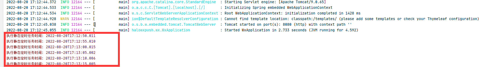
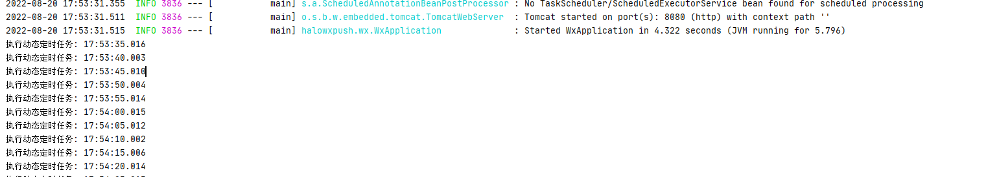
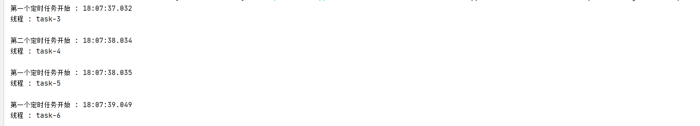

# SpringBoot实现定时任务


SpringBoot创建定时任务，目前主要有以下三种实现方式：

- 基于注解(@Scheduled)： 基于注解@Scheduled默认为单线程，开启多个任务时，任务的执行时机会受上一个任务执行时间的影响；
- 基于接口（SchedulingConfigurer）： 用于实现从数据库获取指定时间来动态执行定时任务；
- 基于注解设定多线程定时任务： 基于注解设定多线程定时任务；

## 1、基于注解(@Scheduled)

### 1.1创建定时器

使用SpringBoot基于注解来创建定时任务比较简单，只需要如下代码即可。代码如下：

```java
@Configuration      //1.主要用于标记配置类，兼备Component的效果。
@EnableScheduling   // 2.开启定时任务
public class SaticScheduleTask {
    //3.添加定时任务
    @Scheduled(cron = "0/5 * * * * ?")
    //或直接指定时间间隔，例如：5秒
    //@Scheduled(fixedRate=5000)
    private void configureTasks() {
        System.err.println("执行静态定时任务时间: " + LocalDateTime.now());
    }
}
```

> Cron表达式参数

- 秒（0~59） 例如0/5表示每5秒
-- 分（0~59）
- 时（0~23）
- 日（0~31）的某天，需计算
- 月（0~11）
- 周几（ 可填1-7 或 SUN/MON/TUE/WED/THU/FRI/SAT）

@Scheduled：除了支持灵活的参数表达式cron之外，还支持简单的延时操作，例如 fixedDelay ，fixedRate 填写相应的毫秒数即可。

**建议：直接点击在线Cron表达式生成器生成参数比较方便：https://www.matools.com/cron/**

### 1.2 启动测试



### 1.3 优缺点
- 优点：注解方式方便
- 缺点：当我们需要调整执行周期的时候，我们需要重启应用。


## 2、基于接口（SchedulingConfigurer）

### 2.1 依赖引入

```xml
    <!-- Mysql驱动包 -->
        <dependency>
            <groupId>mysql</groupId>
            <artifactId>mysql-connector-java</artifactId>
            <version>5.1.30</version>
        </dependency>
        <!--Mybatis-plus-->
        <dependency>
            <groupId>com.baomidou</groupId>
            <artifactId>mybatis-plus</artifactId>
            <version>3.1.1</version>
        </dependency>
        <dependency>
            <groupId>com.baomidou</groupId>
            <artifactId>mybatis-plus-boot-starter</artifactId>
            <version>3.1.1</version>
        </dependency>
        <!--阿里数据库连接池 -->
        <dependency>
            <groupId>com.alibaba</groupId>
            <artifactId>druid-spring-boot-starter</artifactId>
            <version>1.1.14</version>
        </dependency>
```

### 2.2 

开启本地数据库mysql，随便打开查询窗口，然后执行脚本内容，如下：
```sql
DROP DATABASE IF EXISTS `socks`;
CREATE DATABASE `socks`;
USE `SOCKS`;
DROP TABLE IF EXISTS `cron`;
CREATE TABLE `cron`  (
  `cron_id` varchar(30) NOT NULL PRIMARY KEY,
  `cron` varchar(30) NOT NULL  
);
INSERT INTO `cron` VALUES ('1', '0/5 * * * * ?');
```
在application.yml 配置数据源
```yml
spring:
  datasource:
    url: jdbc:mysql://localhost:3306/socks?useUnicode=true&characterEncoding=utf-8&allowMultiQueries=true&useSSL=false&autoReconnect=true&failOverReadOnly=false
    username: root
    password: 123456
    driver-class-name: com.mysql.jdbc.Driver
    type: com.alibaba.druid.pool.DruidDataSource
```

### 2.3 创建定时器

```java
//1.主要用于标记配置类，兼备Component的效果。
@Configuration
// 2.开启定时任务
@EnableScheduling
public class DynamicScheduleTask implements SchedulingConfigurer {

    @Resource
    CronDao cronDao;

    public Cron getCron(){
       List<Cron> cronList =  cronDao.selectList(new QueryWrapper<>());
       return cronList.size()>0 ? cronList.get(0):null;
    }


    /**
     * 执行定时任务.
     */
    @Override
    public void configureTasks(ScheduledTaskRegistrar taskRegistrar) {

        taskRegistrar.addTriggerTask(
                //1.添加任务内容(Runnable)
                () -> System.out.println("执行动态定时任务: " + LocalDateTime.now().toLocalTime()),
                //2.设置执行周期(Trigger)
                triggerContext -> {
                    //2.1 从数据库获取执行周期
                    String cron = getCron().getCron();
                    //2.2 合法性校验.
                    if (StringUtils.isEmpty(cron)) {
                        // Omitted Code ..
                    }
                    //2.3 返回执行周期(Date)
                    return new CronTrigger(cron).nextExecutionTime(triggerContext);
                }
        );
    }

}

```

### 2.4 启动测试




## 3、基于注解设定多线程定时任务

### 3.1 创建多线程定时任务

```java
@Component
@EnableScheduling   // 1.开启定时任务
@EnableAsync        // 2.开启多线程
public class MultithreadScheduleTask {
 
        @Async
        @Scheduled(fixedDelay = 1000)  //间隔1秒
        public void first() throws InterruptedException {
            System.out.println("第一个定时任务开始 : " + LocalDateTime.now().toLocalTime() + "\r\n线程 : " + Thread.currentThread().getName());
            System.out.println();
            Thread.sleep(1000 * 10);
        }
 
        @Async
        @Scheduled(fixedDelay = 2000)
        public void second() {
            System.out.println("第二个定时任务开始 : " + LocalDateTime.now().toLocalTime() + "\r\n线程 : " + Thread.currentThread().getName());
            System.out.println();
        }
    }
```


### 3.2 启动测试




文章参考：https://blog.csdn.net/weixin_38405253/article/details/123748725
